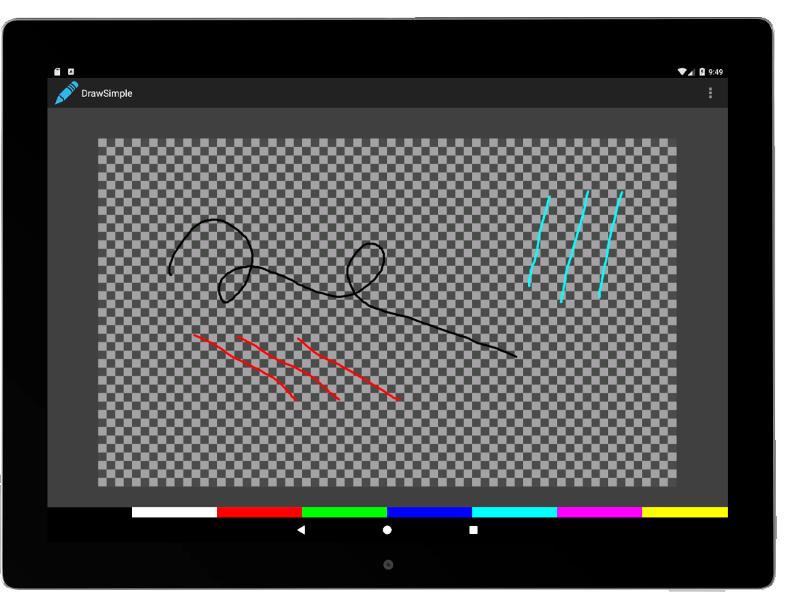

# Readme

## Introduction
This Android application demonstrates how ```MotionEvent``` data may be used to implement a basic drawing application. It supports the choice of multiple brush colors, is sensitive to pen pressure, and allows different tools to have different brush properties.

## Application details
The application consists of three main classes: ```Brush```, ```CanvasView```, and ```State```. These classes represent the object performing the draw, the surface on which drawing occurs, and snapshots of the input device state. As ```MotionEvents``` are received by the ```CanvasView```, their data is transformed into ```State``` objects and provided to the active ```Brush``` for rendering. If a different tool is brought into proximity, a new ```Brush``` object is created with its own properties (e.g. color).



## See also
[App Development](https://developer-docs.wacom.com/android-digitizer/docs/app-development) - Overview of the Android APIs

## Where to get help
If you have questions about this demo, please visit our support page: https://developer.wacom.com/developer-dashboard/support.

## License
This sample code is licensed under the MIT License: https://choosealicense.com/licenses/mit/