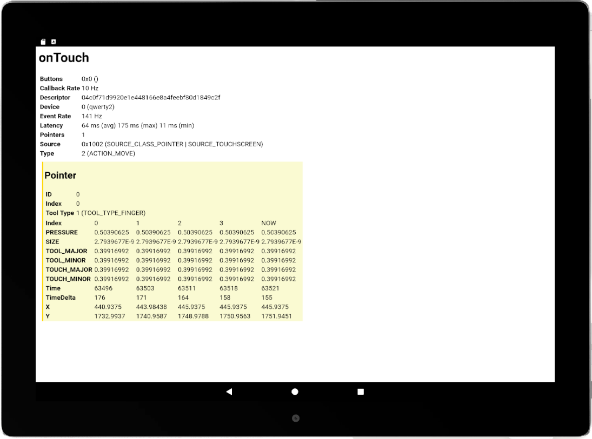

# Readme

## Introduction
This Android application dumps events received from all connected input devices (touchscreen, pen sensor, peripheral mouse, etc.) to the screen for review. Its code highlights the variety of events that can be received as well as the types of data that they contain. This may also be used as a debug tool to understand exactly what events an arbitrary Android app may receive from the hardware.

## Application details
The application splits its UI into two main components: an upper section which contains basic event data and a lower portion containing the axis values. The UI is dynamically updated in real-time, allowing you to monitor changes to the device and its state as they occur. It may not be possible to see all the data being reported, with data overflowing off the sides or bottom of the screen. To fit more data on the screen you may try rotating the screen or adjusting the text size in the Android settings.

The lower portion of the UI may contain several columns with different "index" values: these correspond to any axis updates which were batched into this single event. Event batching allows Android to reduce the callback rate to match the display refresh rate (e.g. 60Hz) without having to throw away events which were generated at a possibly higher refresh rate (e.g. 133Hz stylus updates).

## See also
[App Development](https://developer-docs.wacom.com/android-digitizer-tablets/docs/app-development) - for an overview of the Android APIs

## Where to get help
If you have questions about this demo, please visit our support page: https://developer.wacom.com/developer-dashboard/support.

## License
This sample code is licensed under the MIT License: https://choosealicense.com/licenses/mit/